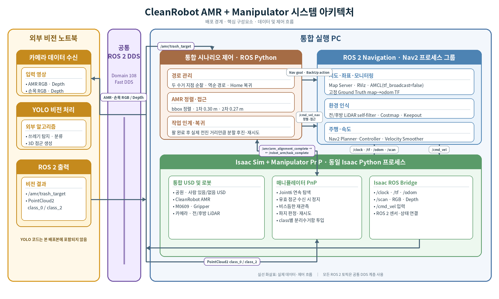
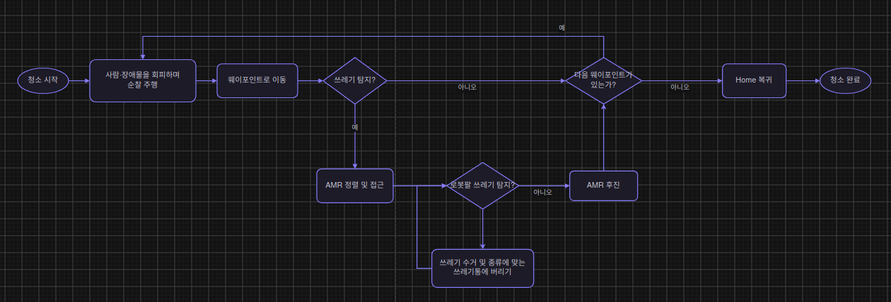

# CleanRobot — 공원 자율주행 쓰레기 수거 로봇

공원을 순찰하며 쓰레기를 탐지하고, AMR이 수거 지점에 정렬·접근하면 M0609 매니퓰레이터가 쓰레기를 집어 종류별 수거함에 분류하는 Isaac Sim·ROS 2 통합 시스템입니다.

▶ [1분 시연 영상](https://drive.google.com/file/d/17ddWwwEUw1dHVDRcB6FfFW53TnRAwtuX/view)



## 주요 기능

- 전·후방 LiDAR와 Nav2를 이용한 공원 순찰, Keepout 구역 회피, Home 복귀
- AMR 전면 및 로봇팔 손목 RGB-D 카메라의 YOLO 쓰레기 탐지
- bbox·depth 기반 AMR 정렬과 2단계 접근
- M0609 매니퓰레이터의 파지·재탐색·재시도·분리수거
- ROS 2 토픽으로 AMR과 매니퓰레이터 작업 인계
- 외부 비전 노트북과 통합 실행 PC를 ROS Domain 108 / Fast DDS로 연결

## 전체 동작 흐름



로봇팔이 쓰레기를 수거·분류한 뒤 같은 지점을 다시 탐지합니다. 더 이상 쓰레기가 검출되지 않으면 AMR이 후진하고 다음 웨이포인트로 이동하며, 모든 지점을 마치면 Home으로 복귀합니다.

## 검증 환경

| 항목 | 구성 |
|---|---|
| OS / Middleware | Ubuntu 22.04.5, ROS 2 Humble, Fast DDS |
| Simulator | Isaac Sim 5.1.0 (`5.1.0-rc.19`) |
| Mobile Robot | CleanRobot 차동구동 AMR, 전·후방 RPLIDAR S2E |
| Manipulator | Doosan M0609, RG2 그리퍼 |
| Vision | Intel RealSense D455, YOLO Segmentation |
| Test PC | Intel Core Ultra 9 275HX, RTX 5080 Laptop, RAM 64GB |

## 저장소 구조

```text
├── docs/                  시스템 구조도, 플로우차트, 토픽 흐름
├── ros2_ws/src/           Nav2·순찰·접근 ROS 2 패키지
├── external_vision_ws/    외부 RGB-D YOLO ROS 2 패키지와 가중치
├── scripts/               환경 점검·빌드·통합 실행 스크립트
└── simulator_code/        매니퓰레이터 PnP·RMPFlow 핵심 코드와 설정
```

GitHub에는 검토에 필요한 코드·문서·모델을 공개했습니다. 약 827MB의 USD, mesh, texture 등 Isaac Sim 실행 자산은 저장소에 포함하지 않았으므로, 시뮬레이션 전체 재현에는 별도 보관된 최종 배포본이 필요합니다.

## 의존성

### 통합 실행 PC

```bash
sudo apt update
sudo apt install \
  python3-colcon-common-extensions python3-rosdep \
  ros-humble-navigation2 ros-humble-nav2-bringup \
  ros-humble-nav2-simple-commander \
  ros-humble-pointcloud-to-laserscan \
  ros-humble-rmw-fastrtps-cpp ros-humble-rviz2
```

### 외부 비전 PC

CUDA 환경에 맞는 PyTorch를 먼저 설치한 뒤 다음을 실행합니다.

```bash
python3 -m pip install -r external_vision_ws/src/yolo_pub/requirements.txt
```

## 빌드와 실행

공개 저장소만으로 확인 가능한 ROS 2 Navigation과 외부 비전 패키지 기준입니다.

```bash
# 통합 PC
source /opt/ros/humble/setup.bash
cd ros2_ws
colcon build --symlink-install
source install/setup.bash

# 외부 비전 PC
cd external_vision_ws
./scripts/01_build_yolo.sh
./scripts/10_run_yolo.sh
```

전체 배포본에서는 다음 순서로 실행합니다.

```bash
export ROS_DOMAIN_ID=108
export RMW_IMPLEMENTATION=rmw_fastrtps_cpp

./scripts/10_run_isaac_pnp_people.sh   # Isaac Sim + Manipulator
./scripts/20_run_nav2.sh               # Navigation
./scripts/30_run_two_trash_control.sh  # 순찰·접근·수거 제어
```

각 스크립트는 전체 배포본의 상대 경로를 기준으로 작성됐습니다. 상세 토픽과 상태 전이는 [topic_flow.md](docs/topic_flow.md)를 참고하세요.

## 주요 인터페이스

| 토픽 | 내용 |
|---|---|
| `/amr/trash_target` | AMR bbox·거리 JSON |
| `/robot_arm/trash_points/class_0` | 캔 PointCloud2 |
| `/robot_arm/trash_points/class_2` | 플라스틱 PointCloud2 |
| `/amr/arm_alignment_complete` | AMR 정렬 완료·작업 인계 |
| `/robot_arm/task_complete` | 매니퓰레이터 작업 완료 |
| `/cmd_vel_nav` → `/cmd_vel` | Nav2 명령과 정렬 필터 출력 |
| `/cobot3/front/scan`, `/cobot3/rear/scan` | 전·후방 LiDAR |

## 결과

- 두 수거 지점의 3개 물체를 탐지·접근·수거한 뒤 Home으로 복귀하는 통합 시연 완료
- 시뮬레이터 약 `8 FPS → 22 FPS`, 맵·설정 조정 후 영상 기준 약 `28 FPS` 확인
- 학습 데이터 색상 편중 수정 후 과도한 오탐 감소
- 팀 비전 모델: Mask mAP50-95 `86.48% → 89.44%`, 최종 Mask mAP50 `97.96%`

약 28FPS는 평균값이 아니라 최종 영상에서 확인한 근사 순간값입니다.
